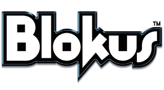
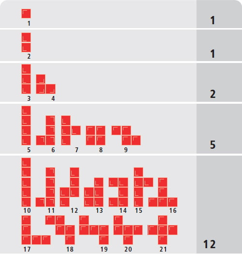
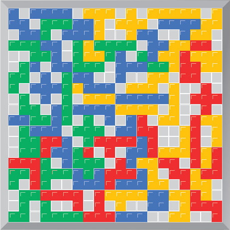
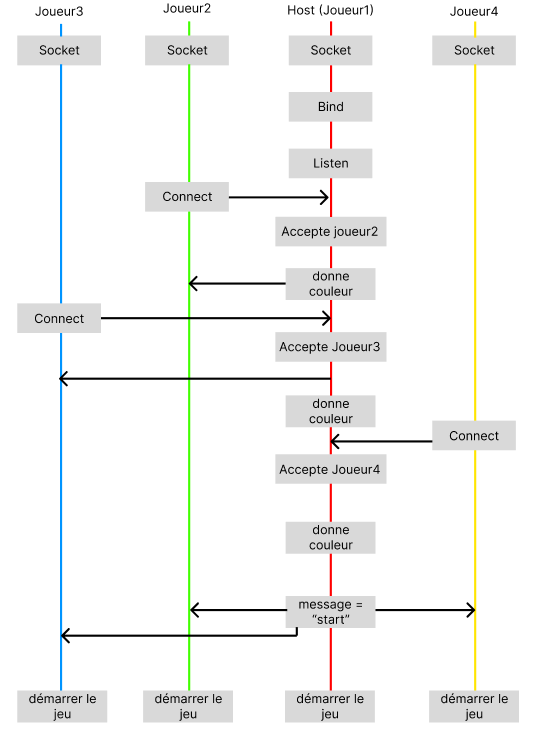
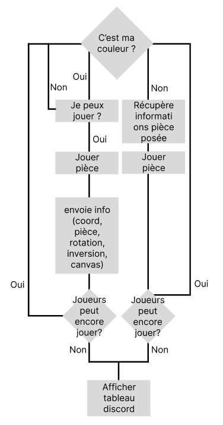
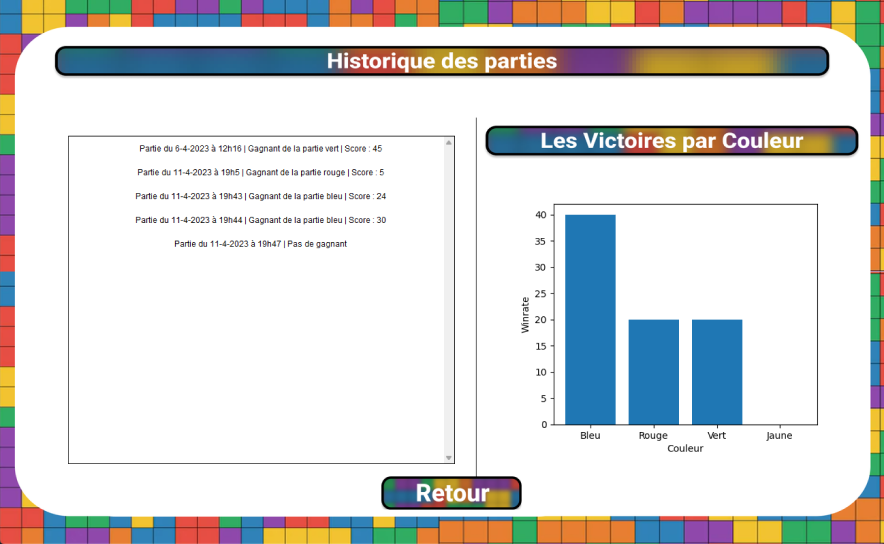
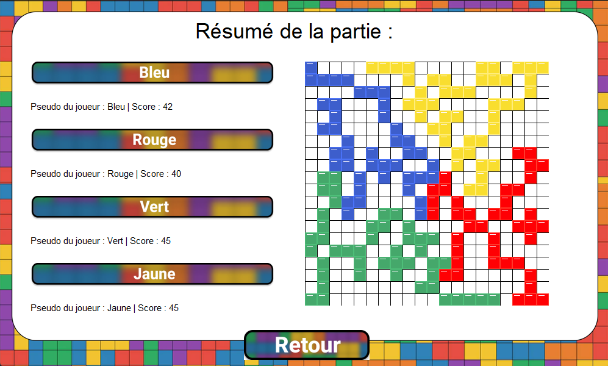

<p  align="center">
  
  <h1 align="center">
    🟨 🟩 🟦 🟥
  </h1>
<p>

<p align="center">
    
    
</p>

> **Auteurs :** [Anthony ELUECQUE](https://github.com/Antorakk), [Frédéric DOURNEL](https://github.com/Fredericdrnl), [Evan LABIT](https://github.com/EvanL2021), [Anatole GINIAUX](https://github.com/Okaneeee)

# **Sommaire 📃**

- **1 Introduction**
    - 1.1 Présentation du projet
    - 1.2 Présentation du jeu
- **2 Technologies utilisées**
    - 2.1 Language de programmation
    - 2.2 Bibliotèques
        - 2.2.1 Tkinter
        - 2.2.2 Customtkinter
- **3 Règles du jeu**
    - 3.1 Pièces
    - 3.2 Placement valide d'une pièce
    - 3.3 Déroulement d'une partie
        - 3.3.1 Début de la partie
        - 3.3.2 Au cours de la partie
        - 3.3.3 Fin de la partie
- **4 IA**
    - 4.1 IA facile
    - 4.1 IA moyenne
    - 4.1 IA difficile
- **5 Réseau**
- **7 Statistiques**
- **6 Copyrights & Droits d'auteur**

## **1 Introduction 📌**

### **1.1 Présentation du projet**

L’IUT Informatique de Calais nous a fixé pour mission de réaliser une application. Elle permettra la mise en place d’une interface de jeu, d’une IA et la possibilité de jouer en réseau. Ce projet est réparti dans différentes SAE sur deux semestres. Pour l’interface, il s’agit d’un jeu de société nommé ‘Blokus’ à développer dans le langage de développement de notre choix. 

### **1.2 Présentation du jeu**

Blokus est un jeu de société créé par Bernard Tavitian en 2000, édité par Sekkoïa et distribué en France par Winning Moves. C’est un jeu de société de plateau se jouant au tour par tour avec 4 joueurs. Chaque joueur dispose d’une couleur et de 21 pièces . Le plateau de jeu est un carré divisé en 400 carrés (20x20). 

## **2 Technologies utilisées 🤖**

### **2.1 Language de programmation**

Pour ce projet, nous avons utilisé le langage de programmation **Python**. Nous avons choisi celui-ci de part ses nombreuses bibliothèques disponible qui nous ont permit de faire le jeu.

<sub>https://www.python.org/</sub>

### **2.2 Bibliotèques**

> #### 2.2.1 Tkinter

Bibliothèque connue par les utilisateurs de *Python* Afin de pouvoir créer des interfaces.

```
pip install tkinter
```

<sub>https://fr.wikipedia.org/wiki/Tkinter</sub>

> #### 2.2.2 Customtkinter

Dérivé de la bibliothèque *Tkinter* permettant de créer des composants plus esthétiques pour une interface.

```
pip install customtkinter
```

<sub>https://github.com/TomSchimansky/CustomTkinter</sub>

## **3 Règles du jeu 🎓**

### **3.1 Pièces**

Les pièces possèdent des tailles et formes différentes, la base même de toute la difficulté du jeu du Blokus.
Il existe 5 tailles de pièces avec : 
- 1 pièce de 1 case 
- 1 pièce de 2 cases 
- 2 pièces de 3 cases 
- 5 pièces de 4 cases 
- 12 pièces de 5 cases 

<p align="center">
    
</p>

Ces 21 pièces sont de couleur jaune, verte, bleue ou rouge pour différencier chaque joueur.


### **3.2 Placement valide d'une pièce**

Pour que le placement d’une pièce soit valide, il faut que celle que l’on désire poser soit en contact avec une pièce de la même couleur et **seulement une diagonale**. Si l’un des cubes d’une pièce est adjacent à un cube d’une pièce déjà posé sur le plateau, il est alors impossible de placer la pièce.Cette règle n’est valable **QUE** pour les pièces d’une même couleur.

<p align="center">
    
</p>

### **3.3 Déroulement d'une partie**

> #### 3.3.1 Début de la partie

Au début de la partie, le joueur qui commence en premier est choisi aléatoirement. Chaque joueur ayant pour obligation de démarrer dans un angle du plateau, la première pièce posée par lui doit avoir un de ses carrés placé dans cet angle pour que le dépôt soit valide. 

<p align="center">
    
</p>

> #### 3.3.2 Au cours de la partie

Chaque joueur joue tour par tour en plaçant une pièce sur le plateau.


> #### 3.3.3 Fin de la partie

Lorsqu’un joueur est bloqué et ne peut plus placer de pièce, il est obligé de passer son tour. Les autres joueurs poursuivent en conservant le même ordre de jeu. Lorsque tous les joueurs sont bloqués, chacun compte le nombre de carrés qu’il n’a pu placer sur le plateau et calcule son score : 
- -1 point par carré non posé. 
- +15 points si les 21 pièces ont été posées. 
- +20 points si les 21 pièces ont été posées avec le carré solitaire (seul et unique sur les 21 pièces) en dernière position. 

## **4 IA 🤖**

Pour notre jeu nous avons conçu 3 types d'IA. Elles fonctionnent que pour la couleur bleu.

### **4.1 IA facile**

Cette IA est juste une IA qui joue aléatoirement, pour cela, nous utilisons la bibliothèque random. 

### **4.2 IA moyenne**

Cette IA utilise l'algorithme mathématiques du Minmax pour faire les meilleures coup possible. Cependant ne prend pas en compte la rotation et l'inversion pour faute de temps de calcul

<sub>l'algorithme du Minmax : https://fr.wikipedia.org/wiki/Algorithme_minimax</sub>

### **4.3 IA difficile**

Cette IA privilégie les pièces qui rapporte le plus de point avec un peu d'aléatoire pour éviter la redondance. Celle-ci prend en charge la rotation ainsi que l'inversion.

## **5 Réseau 📡** 

La partie Réseau ne prend pas en charge les IA. Elle peut se faire sur différent ordinateur temps qu'il sont conecté sur le même réseau internet.

### **5.1 Lancement de la partie**

Pour lancer une partie, il faut se rendre dans le menu *Multiplayer* et ensuite l'host doit créer un serveur. Les autres joueurs doivent saisir l'adresse ip de l'host puis cliquer sur rejoindre. Temps qu'il n'y a pas 4 joueurs, les joueurs ont un waiting screen. Dès qu'il y a 4 joueurs, la partie se lance.

<p align="center">
    
</p>

### **5.2 Pendant la partie**

Après que tout les joueurs ont rejoint, la partie se lance pour tout le monde. L'host est le premier joueur à jouer, dès qu'il a joué, il envoie l'information de la pièce posé aux autre joueur et ainsi de suite pour les autres joueurs. Dès que les 4 joueurs ne peuvent plus jouer, le tableau des scores s'affiche et le jeu disparait. Les statistiques de la partie joué sont disponible que pour l'host de la partie.

<p align="center">
    
</p>

## **6 Statistiques 📊**

Les statistiques sont disponible dans le menu en cliquant sur le bouton *Statistique*. Vous pouvez constater comme information le winrate de chacune des couleurs pour toutes les parties enregistrées ainsi qu'un registre de toutes les parties jouées.

<p align="center">
    
</p>

Si vous cliquer sur une partie vous pouvez voir plus d'information sur la partie comme le plateau avec toutes les pièces posées ainsi que le score de chacun des joueurs.

<p align="center">
    
</p>


## **7 Copyrights & Droits d'auteur ©️**

Tous les <u>sons</u> utilisés sont libres de droit, accessibles et utilisables par tous. <br>
La <u>musique de fond</u> provenant du jeu **Portal 2** qui utilisée sur le menu principal est la propriété intellectuelle de **Valve Corporation**. <br>
Selon l'**Utilisation Équitable** ou **Fair Use** en anglais et du respect de ses quatres facteurs, l'utilisation de la musique du jeu **Portal 2** pour ce projet à fin éducatif et non lucratif, ne brise ni les copyrights ni les droits d'auteurs.

### **Sources:**
- [Mentions légales de Valve](https://store.steampowered.com/legal)
- [Fair Use](https://support.google.com/legal/answer/4558992?hl=en) / [Utilisation Équitable](https://support.google.com/legal/answer/4558992?hl=fr)
- [Digital Media Law Project](http://www.dmlp.org/legal-guide/fair-use)
- [Post sur gaming.stackexchange.com](https://gaming.stackexchange.com/questions/96049/what-are-the-licensing-terms-for-portal-2s-soundtrack)